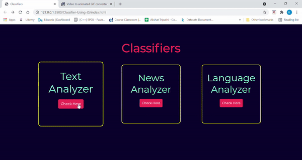

## Screenshots

After clicking on Text Analyzer button, the UI looks like:

After clicking on News Analyzer button, the UI looks like:

After clicking on Language Analyzer button, the UI looks like:

## Live Demo

